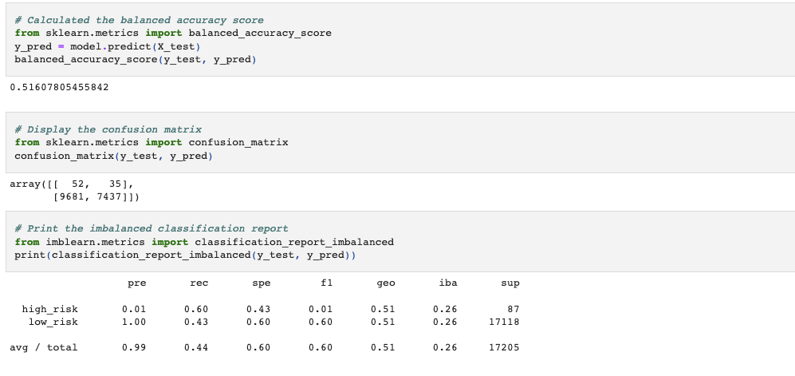
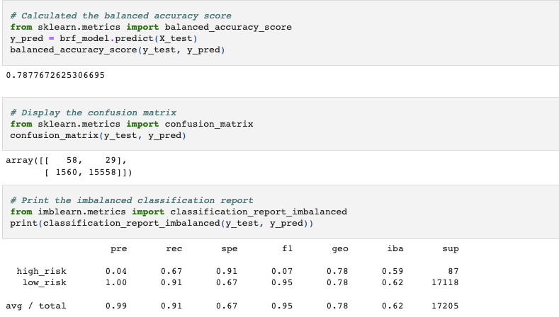
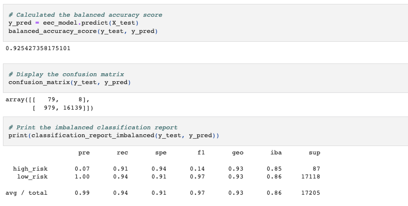

# Credit_Risk_Analysis

## Overview

Credit risk is an inherently unbalanced classification problem, as good loans easily outnumber risky loans. Therefore, different techniques were used to train and evaluate models with unbalanced classes. We also used imbalanced-learn and scikit-learn libraries to build and evaluate models using resampling.

## Results

### Naive Random Oversampling

Balanced Accuracy - 0.64

### SMOTE Oversampling

Balanced Accuracy - 0.64

### Undersampling

Balanced Accuracy - 0.51

### Combination Sampling

Balanced Accuracy - 0.63

### Balanced Random Forest Classifier

Balanced Accuracy - 0.78

### Easy Ensemble AdaBoost Classifier

Balanced Accuracy - 0.92

## Summary

For the credit card data set, the Easy Ensemble AdaBoost Classifier is the best model to choose with its .92 balanced accuracy. While other models were below 0.8. The Easy Ensemble AdaBoost Classifier also had the highest recall score, making it the best machine learning model to choose for further credit card analysis.
